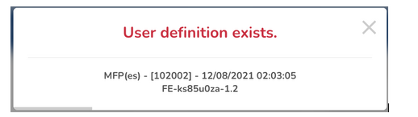

## Rest Exception Handler For Any Spring Project.

#### Abstract
- The exception handler structure of microservice projects needs to be error-descriptive.
- Users shouldn't see application errors or application exceptions.
- Let's think of a scenario: A process needs to go through 4 micro-services, respectively. When it encounters an error in the 3rd microservice or throws an exception, this error needs to be moved backwards correctly, and it is crucial to detect which micro-services has an error and when.
- For this reason, the Exception Output object includes a timestamp, API, error-code, and whoAmI variables. Variables use a front-end (presentation) layer.
- It can connect to any database platform. I.E., Oracle, MsSQL, MySQL, H2, etc.
- You can use a pop-up similar to the one below.

  


```json
// The errors part is filled in method validations.
// As seen in the JSON object, you can see which application, in which module, with which error code, and when the exception occurred.

{
  "errors":[],
  "code":"102002",
  "module":"es",
  "api":"MFP",
  "desc":"User definition exists.",
  "timeStamp":"2021-08-12T03:03:05.952221"
}
```

#### **Lets Begin**


##### **DDL**

- For your exceptions to be read from the database, the table that will keep your exception definitions is created with the following DDL.
```sql
-- TABLE

CREATE TABLE YOUR_SCHEMA.API_TRANSLATIONS
(
    ID          INTEGER           NOT NULL, -- INC
    APPLICATION VARCHAR(255 CHAR) NOT NULL, -- which api.
    MODULE      VARCHAR(255 CHAR) NOT NULL, -- which module of the project. 
    TYPE        VARCHAR(5 CHAR)   NOT NULL, -- Type of definition, "EX" must be entered for Exception. Also, it was added if you use the table to gain i18n for the Front-End sections.
    CODE        VARCHAR(255 CHAR) NOT NULL, -- The code of the exception or Front-End i18n code.
    LOCALE      VARCHAR(5 CHAR)   NOT NULL, -- Definition language. TR; EN, IT vb.
    VALUE       VARCHAR(255 CHAR) NOT NULL, -- It defines the value, and with this value will throw for the exception.
    DESCRIPTION VARCHAR(255 CHAR) NOT NULL, -- Just explain the Exception. You may be throwing the same message for more than one Exception, and you can explain what the difference is. The ExceptionHandler can't throw it to the Front-End.
    PRIMARY KEY (ID)
);
```


##### Properties
- RestExceptionHandler module can connect your Exception table from the datasources that starting when your application is ready.
- In that case, you can give the bean name of the same datasource instead of opening a new connection.
  Also, your queries will query the schema by fetching the relevant datasource bean from the schema.API_TRANSLATIONS table that you have given in this datasource. 
- Configuring the database so that your project can connect to the table where the exception definitions are stored;
```yaml
# Use datasource who already created in the Spring Context with a bean name of dataSource.
# PS: Spring creates a datasource with the bean name of dataSource by default.
common:
  ex-handler:
    defaultErrorCode: -99
    defaultErrorModule: Self
    defaultErrorMessage: We are unable to process your transaction at the moment. Would you please try again later?
    datasource:
      name: dataSource
      schemaName: Kbhkn

------------------------
# Creates a bean with the name of NamedParameterJdbcTemplate in the Spring Context.
common:
  ex-handler:
    defaultErrorCode: -99
    defaultErrorModule: Self
    defaultErrorMessage: We are unable to process your transaction at the moment. Would you please try again later?
    datasource:
      name: datasource_Main
      schemaName: kbhkn
      url: jdbc:oracle:thin:@//localhost:1521/KBHKNDB
      driver: oracle.jdbc.OracleDriver
      # url: jdbc:h2:mem:KBHKNDB
      # driver: org.h2.Driver
      username: Kbhkn
      password: IamAVerySecurePassword!
```
##### Exception Definitions
- Your exceptions must be designed as enums using the given base class and base interface.
- You must insert data into the **api_translations** table with the combination of **module, api, and code** sections in the enum. Below are the table equivalents of the fields in ENUM.
  - MODULE → API_TRANSLATIONS.module
  - API → API_TRANSLATIONS.application
  - CODE → API_TRANSLATIONS.code
- You can throw exceptions in N different languages.
- **You should not create an enum for each exception definition.**
```java
package com.kbhkn;

import com.kbhkn.restexceptionhandler.exceptions.base.ServiceException;
import com.kbhkn.restexceptionhandler.exceptions.types.RestServiceException;
import lombok.Getter;
import lombok.RequiredArgsConstructor;

/**
 * It's an Exception produced by the structure of the Rest Exception Handler.
 * You should add the message, what you want to show the client to the database.
 */
@RequiredArgsConstructor
public enum UserException implements ServiceException<RestServiceException> {
  INVALID_TCKN("100000", "Invalid TCKN: {}"),
  ANOTHER_EXCEPTION_1("100001", "Human readable exception."),
  ANOTHER_EXCEPTION_2("100002", "This message never throws!"),
  ANOTHER_EXCEPTION_3("100003", "You can use it as a note for your team."),
  ANOTHER_EXCEPTION_4("100004", "Or tell something about this exception"),
  ANOTHER_EXCEPTION_5("100005", "throws why? to your co-workers.");

  @Getter
  private final String code;
  @Getter
  private final String desc;

  @Override
  public String code() { return this.code; }

  @Override
  public String desc() { return this.desc; }

  @Override
  public String module() { return "es"; }

  @Override
  public String api() { return "MFP"; }

  @Override
  public RestServiceException exception() {
    return new RestServiceException(this);
  }
}
```
- You have to define every exception definition in the table. It stated that a structure is formed from the combination of module() , api(), and code() fields in the enum.
```sql
INSERT INTO YOUR_SCHEMA.API_TRANSLATIONS (APPLICATION, MODULE, TYPE, CODE, LOCALE, VALUE, DESCRIPTION)
VALUES ('MFP', 'es', 'EX', '100000', 'EN', 'Invalid TCKN: {0}.', 'invalid tckn.');

INSERT INTO YOUR_SCHEMA.API_TRANSLATIONS (APPLICATION, MODULE, TYPE, CODE, LOCALE, VALUE, DESCRIPTION)
VALUES ('MFP', 'es', 'EX', '100000', 'TR', '{0} numaralı TCKN hatalıdır!', 'invalid tckn.');

.
.
INSERT INTO YOUR_SCHEMA.API_TRANSLATIONS (APPLICATION, MODULE, TYPE, CODE, LOCALE, VALUE, DESCRIPTION)
VALUES ('MFP', 'es', 'EX', '100005', 'EN', 'Something..', 'desc.');

INSERT INTO YOUR_SCHEMA.API_TRANSLATIONS (APPLICATION, MODULE, TYPE, CODE, LOCALE, VALUE, DESCRIPTION)
VALUES ('MFP', 'es', 'EX', '100005', 'TR', 'Hata..', 'desc.');
```

#### How to Throw an Exception?

Taking the above code as an example, it can use 4 different methods when throwing an exception.
- .raise() → UserException.INVALID_TCKN.raise();
- .raise(...params) → UserException.INVALID_TCKN.raise("12345678901");
- .exception()
- .exception(...params)

```java
// The enum can throw it with raise(). RestExceptionHandler will replace the part given as a parameter with {0},...{N} in the exception registered in the DB.
UserException.INVALID_TCKN.raise("12345678901");

// The enum can throw it with exception(). RestExceptionHandler will replace the part given as a parameter with {0},...{N} in the exception registered in the DB.
userRepository.findByNumber("12345678901")
        .orElseThrow(() -> UserException.INVALID_TCKN.exception("12345678901"));

if(isUserSomething) {
	UserException.ANOTHER_EXCEPTION_1.raise();
}

userRepository.findBySomething(something)
        .filter(User::isNotBlocked)
        .findFirst()
        .orElseThrow(UserException.ANOTHER_EXCEPTION_1::exception);
```


#### PS
- If you do not insert the exception definition in the enum into the table, you will see the ND_ prefix in the code section of the error information to return. 
- In this case, if you insert the definition, the error message you expect will appear. E.g.;

````json
// Since It did not insert the error with code 100001, the code for the defaultErrorCode value was searched in the table and returned as an error message.
{ 
	"errors":[],
	"module":"es",
	"api":"MFP",
	"code":"ND_100001",
	"desc":"We are unable to process your transaction at the moment. Would you please try again later?",
	"timeStamp":"2021-08-12T02:07:17.0466451"
}
````

### Guides
The following guides illustrate how to use some features:

* [Error Handling for REST with Spring](https://www.baeldung.com/exception-handling-for-rest-with-spring)
* [Spring REST Error Handling Example](https://www.mkyong.com/spring-boot/spring-rest-error-handling-example/)
* [Best way to define error codes/strings in Java](https://stackoverflow.com/questions/446663/best-way-to-define-error-codes-strings-in-java)
* [Define ReadOnly Repository](https://javabeat.net/spring-data-repository-read-only-write-only/)
* [Create a Custom Auto-Configuration with Spring Boot](https://www.baeldung.com/spring-boot-custom-auto-configuration)
